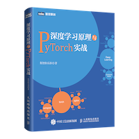

## 深度学习原理与 PyTorch 实战 书籍源码

[本书的图灵社区主页](http://www.ituring.com.cn/book/2609)

本书的目录如下：

1. 深度学习简介
1. PyTorch简介
1. 单车预测器——你的第一个神经网络
1. 机器也懂感情——中文情绪分类器
1. 手写数字识别器——卷积神经网络
1. 手写数字加法机——迁移学习
1. 你自己的Prisma——图像风格迁移
1. 人工智能造假术——图像生成与对抗学习
1. 词汇的星空——词向量与Word2Vec
1. LSTM作曲机——序列生成模型
1. 神经翻译机——端到端的翻译模型
1. AI游戏高手——深度强化学习

## 书籍简介

人工智能（Artificial Intelligence，简称AI），顾名思义，就是通过计算的方式模拟、延伸和扩展人的智能。它作为计算机科学的一个分支，早在1956年就诞生了。然而，长久以来，人工智能的发展却不能与它的名字相匹配。尽管早期的人工智能在数学定理证明、推理、棋类游戏上取得了长足的进步，但是在拟人化的形象思维方面却与人类相差甚远。例如，一个两三岁的小孩能清楚地认出爸爸和妈妈，但是人工智能却不能。

不过，近年来人工智能的发展却在试图摆脱人们对它的刻板印象。采用深度神经网络技术的人工智能同样可以非常好地进行“形象化”思维。的刻板印象。采用深度神经网络技术的人工智能同样可以非常好地进行“形象化”思维。例如，现在人工智能的人脸识别准确度已经达到了99.7%，超过了人类的准确度97.3%。

然而，这些有关人工智能的新闻会给我们造成一种错觉：人工智能是一种高科技，只有谷歌、微软、脸书这样的大公司才有可能应用，而与我们普通人或者小公司毫无关系。事实并非如此，随着各大公司开源了他们的深度学习框架和平台，我们每一个普通企业或者个人都可以快速地应用人工智能技术。你只要有一台笔记本电脑，就可以轻松玩转深度学习，实现诸如人脸识别、图像生成、机器翻译、聊天机器人等强大的人工智能功能。

工欲善其事，必先利其器。选择一个好的人工智能框架平台是我们跨入这个行业的前提，可以说工具选对了，我们的一只脚就已经跨入了人工智能的大门。本书给大家推荐的“器”自然就是PyTorch了，推荐这个深度学习框架平台有如下几点原因。

- 简单、易用、上手快：这一点对于初学者来说是极具吸引力的。
- 功能强大：从计算机视觉、自然语言处理再到深度强化学习，PyTorch的功能异常强大。而且，支持PyTorch、功能强大的包也越来越多，例如Allen NLP（自然语言处理）和Pyro（概率编程）。
- Python化编程：在诸多深度学习开源框架平台中，PyTorch恐怕是和Python结合得最好的一个。相比较TensorFlow框架来说，PyTorch将会让你的代码更流畅舒服。
- 强大的社区支持：对于一个小白来说，如何找到“老司机”来交流经验恐怕是最迫切的问题了。尽管PyTorch仅一岁有余，但是它的社区却成长飞快。在国内，用PyTorch作为关键词就能搜索到大概五六个网络社区、BBS。各大问答类网站关于PyTorch的问题数目也在持续增多。

如此强大的功能，如此好用的工具，绝对是值得我们大力推广的。然而，目前有关PyTorch的多数资料还是以英文为主，大部分介绍深度学习、人工智能的资料还充斥着大量的数学公式，这对普通用户而言是一个不小的门槛。因此，集智俱乐部的成员合力编写了这本书，力求进一步推广PyTorch，普及人工智能和深度学习等新技术。

肩负着这样的使命，本书悄然诞生了。本书内容来源于张江老师在“集智AI学园”开设的网络课程——“火炬上的深度学习”，经各位成员的精心整理和不断完善，最终成书。希望能进一步推广PyTorch，让更多人有机会掌握人工智能和深度学习等新技术，进入人工智能这个发展迅猛的行业，共享人工智能带来的发展红利。